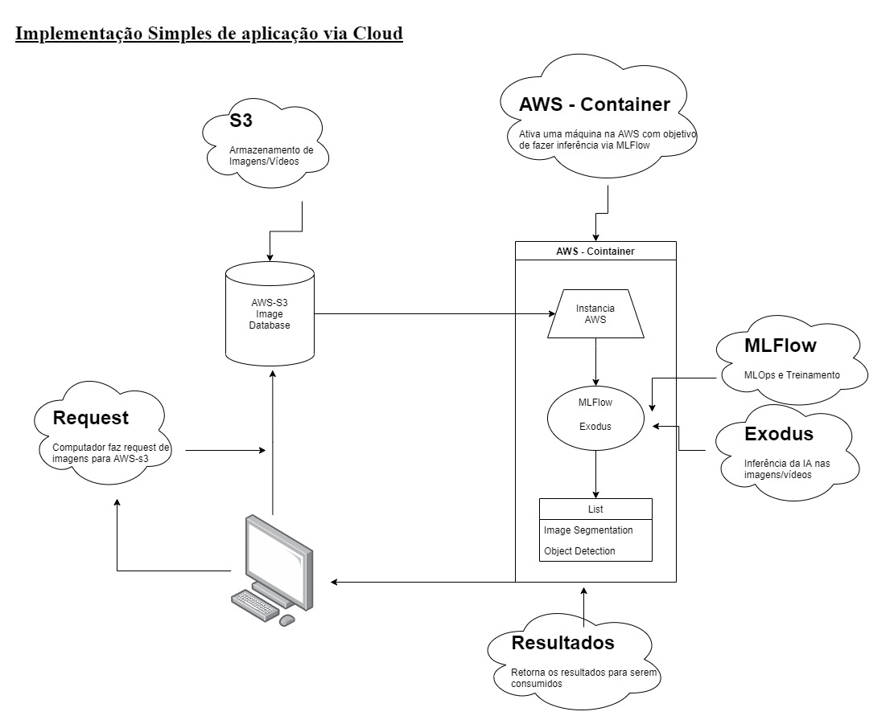

# ExercicioUva-CV-Leo
Prova prática do Processo Seletivo  01317/2021  para o cargo de Pesquisador I - Visão Computacional - Senai Instituto de Inovação em Sistemas Embarcados .

## Arquivos
  - dataExploration.ipynb : Exploração inicial dos dados
  - MaskRCNN.ipynb: Implementação em Mask-RCNN (Não Finalizado)
  - Implementacao.jpg: Arquitetura de Implementação

# Exercício 1

  - **MaskRCNN.ipynb**: Este notebook contém a implementação do dataset "uva" na arquitetura Mask-RCNN para treinamento. Porém, houve complicações na hora de fazer o treinamento o que impossibilitou a continuidade.
  - **YOLOV4**: Treinamento via YOLOV4  https://colab.research.google.com/drive/1S1zWMjuZuHXaZIoowcusWq76YC7fgzgM?usp=sharing

# Exercício 2
  - https://colab.research.google.com/drive/1ur840wKs_j7cj1RE2T7r9u-Y1nTTEyV8?usp=sharing

# Exercício 3

 - Os notebooks contém algumas informações sobre os códigos;

# Exercício 4

  
